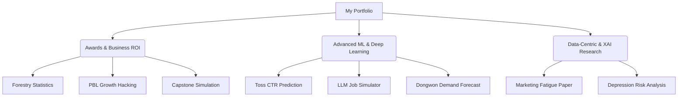

**Lee Jun-hyung (이준형)**

> "Connecting Data, AI, and Business Impact."

[English Version](#-english-version) | [한국어 버전](#-korean-version)

---

> Focus on Data-Centric AI to solve complex business problems and generate clear ROI.\
> Prioritize Explainable AI (XAI) and Domain Expertise over blind deep learning trends.

### 📊 Portfolio Ecosystem

### 💡 Key Impact Metrics
- **🏆 Awards**: 2-time Grand Prize & 1-time Gold Prize winner (Triple Crown).
- **📊 Scale**: Engineered big data pipelines handling **170M+ events** and **850+ dimensions**.
- **📉 ROI**: Proposed data-driven solutions reducing marketing costs by **13.1%**.
- **🚀 Growth**: Achieved **600%** increase in target traffic and **25%** sales growth via O2O growth hacking in a 40% vacancy area.
- **⚡ Speed**: Built real-time evaluation systems with **under 5 seconds** latency using async LLM Agents.

### 🏆 1. Awards & Honors
| Category | Project | Impact & ROI | Key Tech | Result |
| :---: | :--- | :--- | :--- | :---: |
| **Contest** | **[Forestry-Yield-Prediction](https://github.com/junhyung-L/Forestry-Yield-Prediction)** | Built crop-specific optimal cultivation land recommendation and yield prediction models by fusing heterogeneous data based on ANOVA validation and GIS spatial operations. | `RF`, `SVM`, `GeoPandas` | **Grand Prize** |
| **PBL** | **[O2O-Growth-Hacking](https://github.com/junhyung-L/O2O-Growth-Hacking)** | Diagnosed severe commercial decline (**40% vacancy**) and executed a PoC on traditional merchants. Achieved 600% traffic and 25% sales growth via Naver Map optimization and experience design. | `Data Analysis`, `Growth` | **Grand Prize** |
| **Capstone** | **[eEum-Policy-Simulation](https://github.com/junhyung-L/eEum-Policy-Simulation)** | Simulated 66 cashback policy scenarios for maximum ROI under budget constraints. Modeled optimal timing using **Low Pass Filter (LPF)** and **Hurst Exponent**. | `CatBoost`, `LightGBM` | **Gold Prize** |

### 📜 2. Academic Papers
| Research Topic | Contribution & Architecture | Tech Stack | Status |
| :--- | :--- | :--- | :---: |
| **[Investigating Marketing Fatigue](https://github.com/junhyung-L/Marketing-Fatigue-Analysis)** | Operationalized Weber-Fechner Law and Buy Till You Die theories into mathematical decay functions for feature engineering on 170M+ events (0.12% CTR). Proved XGBoost superiority over complex DL and proposed 13.1% cost reduction using TreeSHAP. | `BigQuery`, `XGBoost`, `SHAP` | **KCI** *(Under Review)* |

| Domain | Project | Engineering Highlights | Tech Stack |
| :---: | :--- | :--- | :--- |
| **LLM App** | **[AI-Job-Simulator](https://github.com/junhyung-L/AI-Job-Simulator)** | Combined Role-Lock prompts and zero-shot inference in a 3x3 matrix. Implemented under 5-second low-latency automatic quantitative evaluation architecture via parallel API processing and strict JSON parsing. | `Next.js`, `Claude 3.5` |
| **RecSys** | **[Toss-CTR-Prediction](https://github.com/junhyung-L/Toss-CTR-Prediction)** | Designed a hybrid recommendation architecture combining **DCN-V2 (CrossNetMix)** and **DIN**. Built DL pipelines with **Hash Embedding (262k buckets)** to handle ultra-high dimensional sparse data and prevent OOM. | `PyTorch`, `DCN-V2` |
| **Big Data** | **[Credit-Card-Segmentation](https://github.com/junhyung-L/Credit-Card-Segmentation)** | Built high-performance distributed processing pipelines using Dask on a 2.4M data scale. Minimized data loss via Multi-Output RF-based predictive imputation. *(Top 25%)* | `Dask`, `CatBoost` |
| **Simulation** | **[Dongwon-Demand-Forecast](https://github.com/junhyung-L/Dongwon-Demand-Forecast)** | Developed a cold-start demand forecasting engine for unreleased products using LLM Agent-based synthetic consumer persona generation and Monte Carlo simulations. | `Gemini`, `LGBM` |
| **Healthcare** | **[Depression-Risk-Prediction](https://github.com/junhyung-L/Depression-Risk-Prediction)** | Combined statistical hypothesis testing with White-box modeling (Logistic Regression) to secure high explainability (F1 0.90) required in the medical domain. | `Logistic Reg.` |
| **Mobility** | **[EV-Price-Forecasting](https://github.com/junhyung-L/EV-Price-Forecasting)** | Implemented precise price regression by controlling multicollinearity of derived features via ML-based imputation and non-linear depreciation modeling. | `XGBoost`, `Pandas` |
| **GIS** | **[Elderly-Fall-Prevention](https://github.com/junhyung-L/Elderly-Fall-Prevention)** | Developed a heuristic-based 'Minimum Risk Walking Path' algorithm for the elderly by combining GIS spatial operations and real-time weather data. | `GeoPandas`, `Folium` |

---

> Data-Centric AI를 기반으로 복잡한 비즈니스 문제를 해결하고 뚜렷한 ROI를 창출하는 데이터 분석가 / AI 엔지니어입니다.\
> 딥러닝 트렌드에 매몰되지 않고, 해석 가능성(XAI)과 도메인 최적화(Domain Expertise)를 우선시합니다.

### 📊 포트폴리오 에코시스템 (구조화)

### 💡 Key Impact Metrics (핵심 성과 지표)
- **🏆 Awards**: 2회 대상(인천시장상 등) 및 1회 금상 수상 (총 3관왕).
- **📊 Scale**: **1.7억 건** 이상의 원본 로그 처리 및 850+ 차원의 대용량 정형 데이터 분석 경험.
- **📉 ROI**: 도메인 지식 결합 Feature Engineering을 통해 마케팅 비용 **13.1%** 절감 솔루션 제시.
- **🚀 Growth**: 공실률 40%의 구도심 상권에서 O2O 데이터 그로스해킹을 통한 MZ세대 트래픽 **600%**, 매출 **25%** 증대 달성.
- **⚡ Speed**: LLM Agent 비동기 병렬 처리를 통한 5초 미만(Low-Latency) 실시간 평가 시스템 구축.

### 🏆 1. Awards & Honors (수상 내역)
| 카테고리 | 프로젝트명 | 핵심 역할 및 비즈니스 임팩트 (Impact & ROI) | 핵심 기술 | 결과 |
| :---: | :--- | :--- | :--- | :---: |
| **공모전** | **[2024 산림임업 통계 스마트 경진대회](https://github.com/junhyung-L/Forestry-Yield-Prediction)** | ANOVA 검증 기반 이종 데이터(기후·토양·생산) 융합 분석으로 **작물별 최적 재배지 추천 및 생산량 예측 모델** 구축. GIS 공간 연산 활용. | `RF`, `SVM`, `GeoPandas` | **대상** |
| **PBL** | **[2025 PBL 프로그램 (동인천 구도심 활성화)](https://github.com/junhyung-L/O2O-Growth-Hacking)** | 구도심 공동화(**공실률 40%**) 문제를 진단하고, 전통 점포 대상 PoC를 통해 **MZ세대 트래픽 600% 및 매출 25% 증대** 달성. | `Data Analysis`, `Growth` | **대상** |
| **캡스톤** | **[2025 산학 캡스톤디자인 (인천 e음카드)](https://github.com/junhyung-L/eEum-Policy-Simulation)** | 예산 제약 하 **최대 ROI 달성을 위한 66개 캐시백 정책 시나리오 시뮬레이션**. **LPF(Low Pass Filter)** 및 **Hurst 지수** 분석으로 최적 정책 대안 모델링. | `CatBoost`, `LightGBM` | **금상** |

### 📜 2. Academic Papers (학술 논문)
| 연구 주제 | 아키텍처 및 연구 기여도 (Contribution) | 기술 스택 | 상태 |
| :--- | :--- | :--- | :---: |
| **[마케팅 피로도와 구매 역동성 규명](https://github.com/junhyung-L/Marketing-Fatigue-Analysis)** | 극도의 희소성(0.12% 전환율) **1.7억 건 로그** 데이터에서 경영학 이론(베버-페히너 법칙 등)을 수학적 감쇠 함수로 Feature Engineering 수행. **XGBoost의 우수성 입증 및 TreeSHAP를 활용한 마케팅 비용 13.1% 절감 제안.** | `BigQuery`, `XGBoost`, `SHAP` | **KCI** *(심사 중)* |

| 도메인 | 프로젝트명 | 엔지니어링 하이라이트 (Engineering Highlights) | 기술 스택 |
| :---: | :--- | :--- | :--- |
| **LLM App** | **[AI 기반 직무 롤플레이 시뮬레이터](https://github.com/junhyung-L/AI-Job-Simulator)** | 역할 고정 프롬프트 및 Zero-shot 추론을 3x3 매트릭스로 결합. 병렬 API 처리와 엄격한 JSON 파싱으로 **5초 이하의 자동 정량 평가 아키텍처** 구현. | `Next.js`, `Claude 3.5` |
| **RecSys** | **[토스 NEXT ML 챌린지 (CTR 예측)](https://github.com/junhyung-L/Toss-CTR-Prediction)** | DCN-V2(CrossNetMix)와 DIN을 결합한 하이브리드 추천 아키텍처 설계. **초고차원 희소 데이터 처리 및 OOM 방지를 위한 Hash Embedding(262k 버킷)** 구축. | `PyTorch`, `DCN-V2` |
| **Big Data** | **[신용카드 고객 세그먼트 분류](https://github.com/junhyung-L/Credit-Card-Segmentation)** | 240만 건 데이터 스케일에서 Dask를 활용한 고성능 분산 처리 파이프라인 구축. Multi-Output RF 기반 예측적 결측치 대체로 데이터 손실 최소화. *(상위 25%)* | `Dask`, `CatBoost` |
| **Simulation** | **[동원 x KAIST 신제품 수요 예측](https://github.com/junhyung-L/Dongwon-Demand-Forecast)** | 출시 전 제품의 Cold-Start 문제를 해결하기 위해, **LLM Agent 기반 가상 페르소나 생성 및 Monte Carlo 수요 시뮬레이션 엔진** 개발. | `Gemini`, `LGBM` |
| **Healthcare** | **[우울증 위험 예측 및 요인 분석](https://github.com/junhyung-L/Depression-Risk-Prediction)** | 통계적 가설 검증과 White-box 모델링을 결합하여, 성능(F1 0.90)과 의료 도메인의 필수 요건인 '설명 가능성' 동시 확보. | `Logistic Reg.` |
| **Mobility** | **[전기차 가격 예측 해커톤](https://github.com/junhyung-L/EV-Price-Forecasting)** | ML 기반 결측치 대체 및 비선형 감가상각 모델링을 통해, 파생 피처의 다중공선성을 제어하고 정밀한 가격 회귀 예측 구현. | `XGBoost`, `Pandas` |
| **GIS** | **[제11회 인천시 노인 낙상 방지 맵](https://github.com/junhyung-L/Elderly-Fall-Prevention)** | GIS 공간 연산과 실시간 기상 데이터를 결합하여, 고령자를 위한 Heuristic 기반 '최소 위험 보행 경로' 알고리즘 개발. | `GeoPandas`, `Folium` |

---

> "I don't just build models; I solve business problems."\
> 가치 있는 데이터 분석은 정밀한 예측을 넘어, 올바른 의사결정을 이끌어내고 비즈니스 ROI를 창출할 때 비로소 완성된다고 믿습니다.

- **📄 Resume**: [Click Here](https://github.com/junhyung-L/Resume)
- **📫 LinkedIn**: [Click Here](www.linkedin.com/in/junhyung-lee-ba4b6139b)
